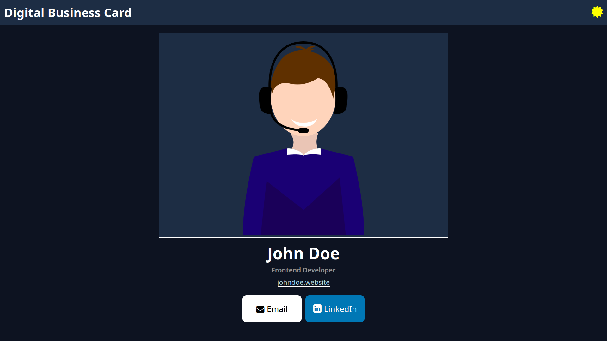

# Digital Business Card

A sleek and accessible web app built with React and Vite. Showcase your
professional profile with ease, featuring a dynamic dark/light mode for
personalized viewing.

## Preview

## Opening the Project with NPM

To run this project locally, follow these steps:

1. Clone the repository
   (`git clone https://github.com/caiohenrique-3/digital-business-card.git`)

2. Navigate to the project directory (`cd digital-business-card`)

3. Install dependencies (`npm install`)

4. Start the development server (`npm run dev`)

The project will be accessible at http://127.0.0.1:8080.

## Contributing

To contribute to this project, follow these steps:

1. Fork the repository
2. Create a new branch (`git checkout -b feature`)
3. Make your changes and commit them (`git commit -m 'Add new feature'`)
4. Push to the branch (`git push origin feature`)
5. Open a pull request

## Issues

If you encounter any issues or have suggestions for improvements, please
[open an issue](https://github.com/caiohenrique-3/digital-business-card/issues).

## Acknowledgments

Special thanks to the following resources for their contributions to this
project:

- [Fork Awesome](https://forkaweso.me/Fork-Awesome/)
- [Google Webfonts Helper](https://gwfh.mranftl.com/fonts)
- [Coolors](https://coolors.co/)

## License

This project is licensed under the [MIT License](LICENSE).

---
